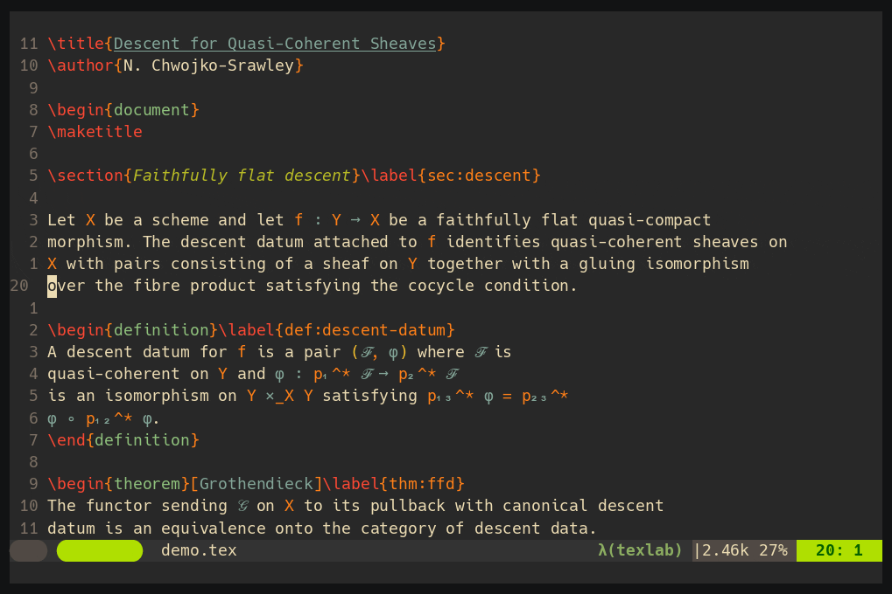
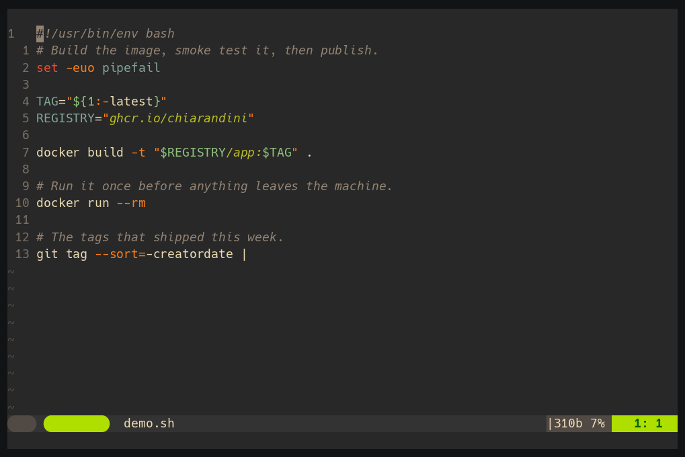

# smart-enter.nvim

A context dispatched newline. One insert mode key (default `<S-CR>`) does the
right thing for where the cursor is:

- continues a LaTeX environment (`\\` in a matrix, `\\` then `&= ` in `align`, `\item ` in a list)
- continues a Markdown list, checkbox, or blockquote (renumbering ordered lists, exiting on an empty item)
- continues a shell command (` \` and an indented line), staying out of the way where a backslash would be wrong
- otherwise inserts a plain newline that does not re-insert a comment leader



Rules are plain data. Detection is Treesitter based for LaTeX (no VimTeX
dependency) and Lua pattern based for line shapes. Extend any filetype through
`setup()` opts.

## Requirements

- Neovim 0.10 or newer (`vim.keycode`, and `vim.treesitter` for the latex preset)
- The `latex` Treesitter parser, for the latex preset
- A terminal that sends `<S-CR>` distinctly from `<CR>` (Kitty, WezTerm, iTerm2
  with the CSI u profile, most GUIs). Otherwise set a different `key`, or set
  `key = false` and drive `dispatch()` from your own mapping.

Run `:checkhealth smart_enter` to confirm the key, the parser, and the
configured filetypes.

## Setup

Call `require("smart_enter").setup{}` once:

```lua
require("smart_enter").setup({
  key      = "<S-CR>",     -- insert mode map; false to skip and drive dispatch() yourself
  fallback = "newline",    -- "newline" (no comment leader) | "cr" | false | function(ctx)
  filetypes = {
    markdown = { preset = "markdown" },
    tex      = { preset = "latex" },
    latex    = { preset = "latex" },
    sh       = { preset = "shell" },
    zsh      = { preset = "shell" },
  },
})
```

With [lazy.nvim](https://github.com/folke/lazy.nvim), the `opts` table is
lazy's way of passing that config, and `config` calls `setup`:

```lua
{ "Chiarandini/smart-enter.nvim", event = "InsertEnter",
  opts = { filetypes = { markdown = { preset = "markdown" }, tex = { preset = "latex" } } },
  config = function(_, opts) require("smart_enter").setup(opts) end }
```

## Presets

`markdown` — checkbox, unordered, ordered (incrementing), and blockquote
continuation; an empty item drops its marker and leaves the list.

`latex` — environment continuation via Treesitter, honouring nesting: `\\` in
the matrix and gather families, `\\` then `&= ` in the align family, `\item `
in lists.

`shell` — closes the line with ` \` and opens an indented continuation line.
Filetype `sh` covers both `.sh` and `.bash`; `zsh` is separate.



The interesting half is where it *declines*, falling through to a plain
newline, because a backslash there would be wrong:

| Position | Why |
|---|---|
| blank line | nothing to continue |
| comment | the `\` is commented out, silently ending the command |
| inside `'...'` | `\` is literal in single quotes |
| line already ends in `\` | a second one escapes the first, ending the command while still looking right |
| after `\|` `\|\|` `&&` `;` `{` `(` `then` `do` `else` `in` | the shell already continues on its own |
| heredoc body | the body is data |

Quoting is tracked, so the `#` in `echo "a # b"` is not read as a comment. The
first continuation line indents one `shiftwidth`; later ones hold that indent
rather than stepping deeper.

## Extending

`filetypes[ft]` is `{ preset = <name|list>, rules = {...} }`. Your `rules` are
tried before the preset's, so they win:

```lua
-- adds a rule without touching the latex preset
require("smart_enter").setup({ filetypes = { tex = { rules = {
  { env = "exercise", item = "\\Question " },
} } } })
```

A `["*"]` filetype applies its rules to every filetype, after that filetype's
own rules. Use it for behaviour you want everywhere, for example continuing a
comment leader read from `commentstring`.

### Rule shapes

Insert fixed text around the break with `append` and `prefix`. The new line is
indented to the current line, then `prefix`; `append` is glued to the current
line at the cursor (the row separator):

```lua
{ env = "align", append = "\\\\", prefix = "&= " }   -- match one environment
{ pattern = "^%s*> ", prefix = "> " }                -- match on the line text
```

Continue a list with `item`. The new entry lines up with the current entry,
not with the deeper indent of a soft wrapped continuation line, and pressing on
an empty entry clears the marker and exits the list. `item` is a string, or a
table with `exit_empty` and `counter`:

```lua
{ envs = { "itemize", "enumerate" }, item = "\\item " }
{ env = "exercise", item = "\\Question " }
{ env = "notes",    item = { text = "\\item ", exit_empty = false } }
{ env = "steps",    item = { text = "\\item[{})] ", counter = "alpha" } }  -- a), b), c)
```

`counter` is `"arabic"`, `"alpha"`/`"Alpha"`, or `"roman"`/`"Roman"`; the `{}`
in `text` becomes the previous entry's counter plus one.

`continuation` is the suffix counterpart of `item`: rather than opening the new
line with a marker, it closes the old one with it, then indents. Pair it with a
matcher, since a continuation marker is only legal in some positions:

```lua
{ match = ok_here, continuation = "\\" }                        -- shell, make, C macros
{ match = ok_here, continuation = { marker = "`", sep = " " } } -- powershell
```

Trailing whitespace before the marker and leading whitespace on the carried
tail are both trimmed. The new line indents one `shiftwidth` deeper, then holds
that indent while the previous line already ends in the marker; override with
`indent` (a string, or a function of `ctx`).

Run your own logic with `handle` for anything the fields above do not cover.
It returns `false` to fall through to the next rule; anything else (including
`nil`) counts as handled:

```lua
{ pattern = "^(%s*)(%d+)%.%s(.*)", handle = function(ctx, caps)
    ctx.split("", caps[1] .. tostring(tonumber(caps[2]) + 1) .. ". ")
end }
```

The `ctx` object exposes `ctx.split(append, prefix)`, `ctx.replace_line(text)`,
and the fields `buf`, `win`, `row`, `col`, `line`, `head` and `tail` (the line
either side of the cursor), `ws`, `filetype`.

### Matchers and actions

The `env`, `pattern`, and `item` fields cover the common rules. For anything
else, two modules give building blocks for a rule's `match` and `handle`:

- `require("smart_enter.matchers")`: `pattern(lua_pat)`, `ts_env(names[, lang])`,
  and `env_chain(ctx[, lang])` (enclosing environment names, innermost first).
- `require("smart_enter.actions")`: `item(template)` and `continuation(spec)`,
  the handlers behind the `item` and `continuation` fields.

Both are `require`d, so call them where `setup` runs, for example inside a
`config` function, the same as any Lua module loaded at startup.

## Binding to plain `<CR>`

If you want the smart behaviour on `<CR>` and already map `<CR>` for autopairs
or completion, keep `key = false` and compose in your own map. `dispatch({ fallback = false })`
runs the rules, skips the built in fallback, and reports whether a rule matched:

```lua
vim.keymap.set("i", "<CR>", function()
  if require("smart_enter").dispatch({ fallback = false }) then
    return
  end
  -- no rule matched: run your existing <CR> behaviour here
end)
```

## Non-goals

smart-enter stays small on purpose. These belong to dedicated plugins:

- Renumbering or reformatting a whole list after later edits (see autolist.nvim).
- `<Tab>` and `<S-Tab>` indent and dedent of list items.
- Normal mode `o` and `O` continuation. You can bind `dispatch()` to any key.

## API

- `require("smart_enter").setup(opts)`
- `require("smart_enter").dispatch(opts?)`: run the smart action; returns `true`
  when a rule handled it. `opts.fallback = false` skips the built in fallback so
  you can compose with your own `<CR>` behaviour. Bind it from any key.
- `require("smart_enter").inspect([lang])`: report the filetype, the Treesitter
  environment chain, and which configured rules match at the cursor. Run it
  where the key behaves unexpectedly to see what the rules see.
